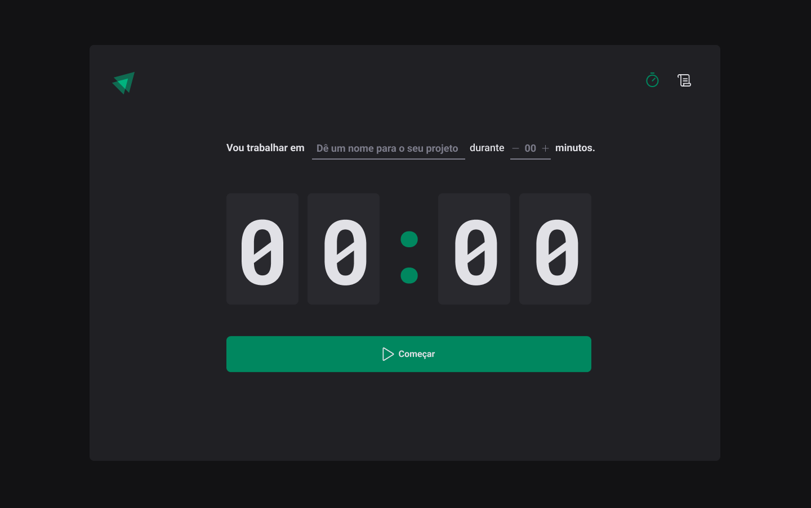
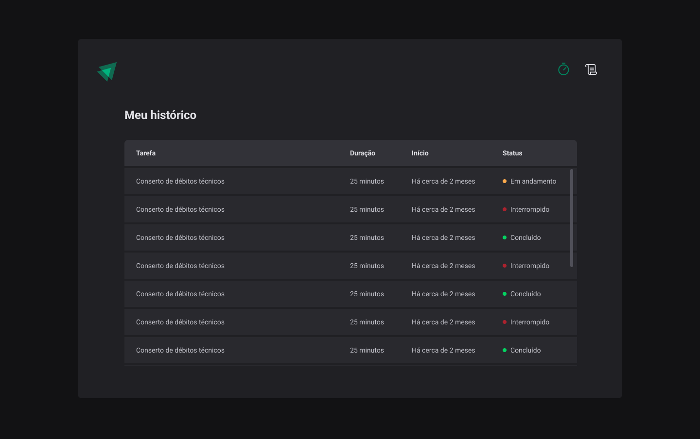

<h1 align="center">
  Ignite Timer
</h1>

<p align="center" margin-top="25px" >
  

  

  
  
</p>



___

## 💻 About

Ignite-timer - Counter to usue with Pomodoro technique.

Project developed during the ReactJS Ignite Course from Rocketseat.
### features:
- Create a timer
- Interrupt timer
- Log timer history
- Persist data in local storage

Although there are few features, concepts such as:
- States
- State immutability
- Lists and keys in ReactJS
- ContextAPI
- LocalStorage
- Properties
- Componentization
- Eslint
- Reducer
___

## 🛠 Tech Stack

This project was developed with the following technologies:

- [React](https://reactjs.org)
- [Vite](https://vitejs.dev)
- [TypeScript](https://www.typescriptlang.org)
- [React-Hook-Form](https://react-hook-form.com)
- [styled-components](https://styled-components.com)
- [Immer](https://immerjs.github.io/immer)

___

## 🚀 How it works

### Pre-requisites
Before you begin, you will need to have the following tools installed on your machine: [Git] (https://git-scm.com), [Node.js] (https://nodejs.org/en/). In addition, it is good to have an editor to work with the code like [VSCode] (https://code.visualstudio.com/)

#### 🧭 Running the web application (Frontend)

```bash
# Clone this repository
$ git clone git@github.com:exodogurgel/ignite-timer.git

# Access the project folder in your terminal
$ cd ignite-timer

# Install the dependencies
$ npm install

# Run the application in development mode
$ npm run dev

# The application will open on the port: 3000 - go to http://localhost:5173
```
___

## 🦸 Author

<a href="https://blog.rocketseat.com.br/author/exodo/">
  
 <br />
 <sub><b>Êxodo Gurgel</b></sub></a> <a href="https://blog.rocketseat.com.br/author/exodo/" title="Rocketseat"></a> 🚀
 <br />

[](https://www.linkedin.com/in/exodo-gurgel/) 
[](mailto:exodowellis@gmail.com)

---

## 📝 License

This project is under the license [MIT](./LICENSE).

Made with ❤️ by Êxodo Gurgel 👋🏽 [Get in Touch!](Https://www.linkedin.com/in/exodo-gurgel/coffee-delivery)

---
